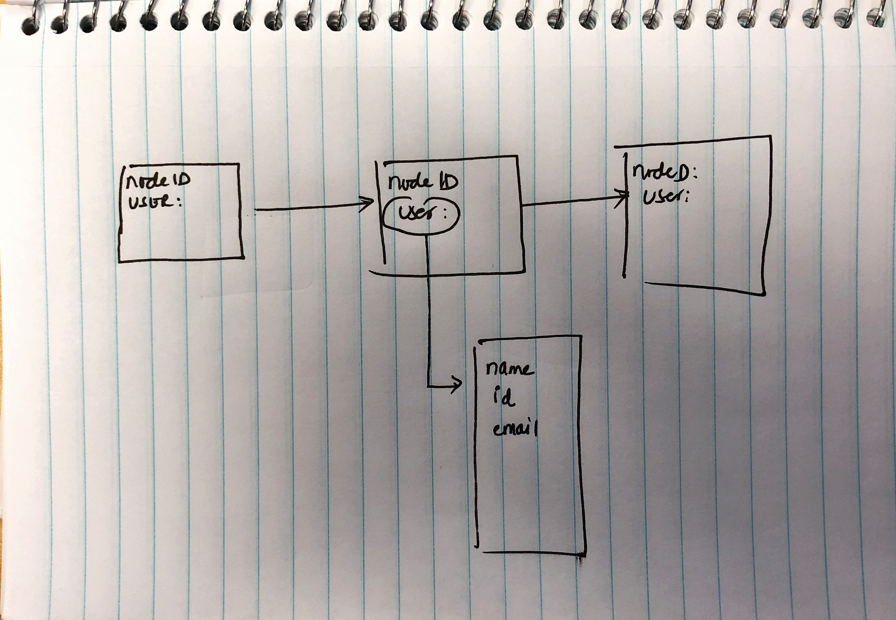

# **UI sample problem: ( Nodes )**

- We will build a simple single page application that shows the Nodes of an approval route. Meaning, there is an approval process, and three users need to take action to go from one node to another. 
- Each Node will be assigned to an user, and once the user approves, the system should go to the next node. 
- When the user clicks on the Node, we need to show a panel, that shows the user information of the current node. 
- There should be a flow between nodes, meaning, we should have someway to know that node2 is after node1 and so on. Take a look at the example: 
- Clicking on the node should open up a panel with user information. 

**Constraints**

Use Bootstrap here: 

https://getbootstrap.com/

Also use a custom theme here: 

https://github.com/Esri/calcite-bootstrap

 Use the JSON Server to mockup an endpoint

https://github.com/typicode/json-server

Take a look at [db.json](files/db.json)

Create an AngularJS app that shows the nodes in the following order, an example implementation is below: 

